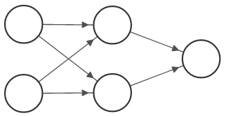
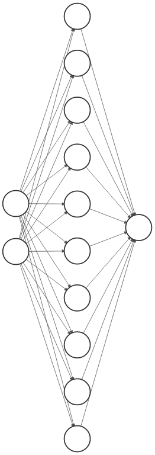
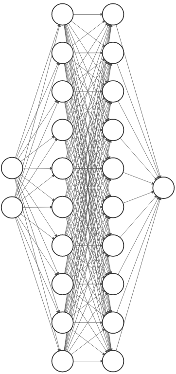

# Multilayer Perceptron em Haskell

obs: Projeto conduzido no contexto da disciplina de Paradigmas de Programação, na UFABC.

# 1. Definição formal de um Multilayer Perceptron 

Uma MLP (_Multilayer Perceptron_) é uma arquitetura de rede neural de aprendizado profundo do tipo feedforward, construída como uma sequência composições de aplicações parametrizadas por um conjunto de pesos ajustáveis.

Definindo de maneira geral, suponha que a rede possua  camadas, onde as camadas  e  são, respectivamente, as camadas de entrada e saída. Suponha que a camada , para  contém  neurônios - portanto  é a dimensão dos dados de entrada. Definimos  como a matriz de pesos da camada , e  é o vetor de viéses da camada . De modo geral, a rede é um mapeamento de . Dado um input , o mapeamento da rede pode ser descrito por
	


&space;\in&space;\mathbb{R}^{n_{l}})
	
Caso se tenha um conjunto de dados de  amostras em , , com valores objetivo \}_{i=1}^{N}$&space;em&space;$\mathbb{R}^{n_{L}}), pode-se definir uma função de custo parametrizada pelos pesos adaptativos da rede, digamos ), e assim, o problema de aprendizado dos melhores parâmetros para a rede é identificado com o problema de minimizar o custo ) em relação a . Porém, devido à composição de funções não-lineares ao longo das camadas da rede, a função de custo pode se tornar não-convexa, perdendo a garantia de ótimos globais ou soluções analíticas, e para o treinamento de RNAs passa-se a utilizar métodos de otimização iterativos baseados no operador gradiente, que é capaz de alcançar mínimos locais -- ainda assim, muitas vezes suficientes para um dado problema. 
	
Um dos métodos de ajuste dos pesos da rede é denominado _Gradiente Descendente_, em que se aplica iterativamente a correção dos pesos na direção do gradiente da função de custo, i.e.
	
)
	
onde  é a _taxa de aprendizado_ e  é o operador gradiente.  Quando se tem um número de pesos ajustáveis e de amostras muito grande, o cálculo do gradiente se torna demasiadamente custoso e uma alternativa passa a ser o método de _Gradiente Descendente Estocástico_, em que o ajuste pode ser feito em  etapas, onde em cada uma delas uma amostra é selecionada aleatoriamente, sem reposição, para o cálculo do custo e ajuste dos pesos.
	
O cálculo do gradiente pode encontrar dificuldades quando a função de custo ou as funções de ativação das camadas intermediárias são difíceis de se derivar. Uma solução é utilizar um algoritmo de _gradiente automático_ (Autograd), que calcula o gradiente de qualquer função em um ponto a partir da decomposição da função em operações elementares compostas e a aplicação da regra da cadeia.

# Implementação em Haskell

A execução do programa pode ser feito via _stack run_, que executará as implementações de diferentes estruturas em diferentes datasets, apresentando o valor do custo antes e depois do treinamento em cada caso. Um dos exemplos utiliza o dataset "MNIST", o que pode levar um tempo para executar. Uma alternativa é abrir o _ghci_ e executar cada exemplo separadamente - o ghci carrega todos os módulos e as funções tem os mesmos nomes dos arquivos.  Um exemplo de execução pode ser encontrado no [youtube](https://youtu.be/HFXyeMn7dic). 

A implementação da arquitetura da MLP em Haskell levou em consideração a possibilidade de aplicação do algoritmo de gradiente automático, disponibilizado pelo pacote AD, no ajustamento dos pesos para o aprendizado por gradiente descendente, o que permite uma maior flexibilidade para a definição de arquiteturas sem a necessidade de adaptar o algoritmo de backpropagation para cada modelo. Brevemente, a função _grad_ do pacote possibilita o cálculo do gradiente de qualquer função com respeito a uma variável que seja uma instância de _Traversable_. Assim, pode-se definir uma estrutura de rede da classe Traversable, passada como argumento para uma função de custo cujo gradiente será calculado pela função _grad_. A função retorna um valor do mesmo tipo do argumento da função de custo - no caso, retorna uma rede inteira com os pesos para ajuste. A correção é feita subtraindo da rede inicial a rede devolvida por _grad_.

Buscou-se implementar as estruturas de forma modular, isto é, o usuário pode construir as camadas independentemente, escolhendo suas dimensões e funções de ativação, compondo-as em uma estrutura final. Pode, ainda, escolher uma função de custo qualquer. No fim, o algoritmo dá conta de calcular a estimativa da rede e de corrigi-la, dada uma amostra ou um dataset. O uso final da rede torna-se, portanto, bastante simples e adaptável. A rede segue a definição teórica, entendendo a rede como um tipo _Network_ que envolve uma lista de tipos _Component_ que, por sua vez, são constituídos por uma lista de pesos, uma função de ativação e uma função de propagação. 

```haskell
newtype Network a = Network [Component a]
                    deriving (Functor, Foldable, Traversable)
		    
data Component a =  Component { layers :: [Weights a]
                              , activationFunction :: ActivationFunction
                              , propagate :: PropagationFunction} 
                              deriving (Functor, Foldable, Traversable)
```

Por enquanto, foram implementadas as funções de ativação mais comumente utilizadas, i.e. Sigmoid, ReLU e Tangente Hiperbólica. Elas são inicialmente definidas como tipos de dados a serem passadas para a função _activate_, que se encarrega de realizar as operações adequadas para o tipo de função especificado.

```haskell
data ActivationFunction = Sigmoid | ReLU | Tanh | Id
    deriving (Show)
activate :: (Ord a, Num a, Floating a) => ActivationFunction -> a -> a 
activate Id x = x
activate Sigmoid x = 1.0 / (1.0 + exp(-x))
activate Tanh x = (exp(2*x) - 1) / (exp(2*x) + 1)
activate ReLU x = max 0.0 x
```

A definição genérica tem por objetivo possibilitar a construção de redes distintas de uma MLP utilizando esta mesma infraestrutura. No caso da MLP, as componentes são camadas ditas _lineares_, construídas pela função _\_Linear_ que cria uma componente com uma matriz  de pesos e um vetor  de vieses e uma função de ativação dentre aquelas contempladas no tipo de dado _ActivateFunction_. Para cada tipo de componente pode-se definir uma função de propagação, listando-a no tipo _PropagationFunction_ - neste caso, tem-se a função de propagação do tipo "Linear" que faz a aplicação tal como definida anteriormente ("Pass" é a função identidade). 

```haskell
_Linear :: (Floating a) => (Weights a, Weights a) -> ActivationFunction -> Component a
_Linear (w, b) a = Component { layers = [w, b]
                             , activationFunction = a
                             , propagate = Linear}
```

Dessa forma, torna-se fácil expandir o projeto a fim de acrescentar outros tipos de camadas, bastando implementar novas funções de ativação, propagação e construtores de componentes. A correção é feita por gradiente automático, de modo que não é necessário implementar um algoritmo de backpropagation, nem se limitar, por este motivo, ao uso de funções de custo de fácil derivação. Torna-se mais fácil, portanto, experimentar com estruturas de redes.

Para a propagação de uma entrada em uma camada, é aplicada a função _triggerComponent_ que recebe uma componente e aplica parcialmente a função de propagação implementada (selecionada pelo tipo PropagationFunction) com os parâmetros especificados, quais sejam: os pesos e a função de ativação, retornando uma função  que é aplicada em uma entrada  através da função _forwardApply_. 

```haskell
triggerComponent :: (Ord a, Floating a) => Component a -> ((InputZ a, InputY a) -> (OutputZ a, OutputY a))
triggerComponent c = triggeredComponent
    where
        f = propagate c
        w = layers c
        a = activationFunction c 
        triggeredComponent = getPropagationFunction f a w -- (M.Matrix a, M.Matrix a) -> (M.Matrix a, M.Matrix a)
	
data PropagationFunction = Linear | Pass
    deriving (Show)
    
getPropagationFunction :: (Ord a, Floating a) => PropagationFunction -> (ActivationFunction -> [Weights a] -> ((InputZ a, InputY a) -> (OutputZ a, OutputY a)))
-- z : combinação linear
-- y : ativação
getPropagationFunction Pass = \_ _ x -> x
getPropagationFunction Linear = \a [w, b] i -> let (x, z) = (snd i, multStd w x + b) 
                                                in (z, fmap (activate a) z)
	
forwardApply :: ((InputZ a, InputY a) -> (OutputZ a, OutputY a)) -> (InputZ a, InputY a) -> (OutputZ a, OutputY a)
forwardApply f = f
```

A propagação de uma entrada na rede é feita pela função _forward_ e consiste em um _scanl_ na lista de componentes, utilizando a composição das funções "triggerComponent" e "forwardApply", que são sucessivamente aplicadas na saída de cada camada (componente) da rede até a saída final do modelo. A função _forward_ retorna uma lista com as entradas e saídas de cada camada. Se estamos interessados somente na saída final da rede, utilizamos a função _estimate_ que aplica a função _forward_ e seleciona apenas o resultado da última camada do modelo.

```haskell
forward :: (Ord a, Floating a) => Network a -> Input a -> [(OutputZ a, OutputY a)]
forward (Network layers) x = scanl (\x c -> forwardApply (triggerComponent c) x) (x, x) layers

estimate :: (Ord a, Floating a) => Network a -> Input a -> Output a
estimate net x = snd (last (forward net x))
```

O ajuste da rede é realizado com o gradiente retornado pela função _costGrad_ que recebe uma rede, uma amostra e um indicador de função de custo (o tipo _Loss_), calculando o gradiente com relação à própria rede (cálculo este que é feito automaticamente pela biblioteca de Autograd).  Para isso, a função _stochasticLearning_ aplica em um conjunto de amostras a função auxiliar _stepLearning_, que faz uma iteração de _forward pass_, cálculo do gradiante e update da rede.

```haskell
stochasticLearning :: (Ord a, Floating a) => (Network a, Sample a) -> Loss -> a -> (Network a, Sample a)
stochasticLearning (network, samples) loss lrate = (foldl (\net s -> stepLearning net s loss lrate) network samples', samples')
    where
        samples' = fst $ shuffle' samples (mkStdGen seed)
        seed = 0

stepLearning :: (Ord a, Floating a) => Network a -> (Input a, Target a) -> Loss -> a -> Network a
stepLearning network (input, target) loss lrate = network - fmap (*lrate) gradient
    where
        gradient = costGrad network (input, target) loss
	
costGrad :: (Ord a, Floating a) => Network a -> (Input a, Target a) -> Loss -> Network a
costGrad network (input, target) loss = grad (calcLoss (fmap auto input, fmap auto target) loss) network
```

O sistema permite a construção de modelos para classificação e regressão. Para isso, foram implementadas as funções de custo de _Entropia Cruzada_ (Cross Entropy) e de _Erro Quadrático Médio_ (Mean Squared Error), mais adequadas para o cálculo de custo em problemas de classificação e regressão, respectivamente. 

```haskell
sqrdError :: Floating a => M.Matrix a -> M.Matrix a -> a
sqrdError y ŷ = sum (fmap (^2) (ŷ - y)) / l
    where
        l = fromIntegral $ length y

crossEntropy :: Floating a => M.Matrix a -> M.Matrix a -> a
crossEntropy y ŷ = - sum (zipWith f y' ŷ')
    where
        f = \x y -> x * log y 
        y' = M.toList y
        ŷ' = M.toList ŷ
```

Para garantir a generalidade do sistema, na definição do modelo a seleção da função de custo pode ser feita facilmente especificando o seu tipo (um tipo de dado _Loss_), e a função correspondente é escolhida pela função _getLoss_, e aplicada pela função _calcLoss_

```Haskell
data Loss = SE | CE
getLoss :: Floating a => Loss -> (M.Matrix a -> M.Matrix a -> a)
getLoss SE = sqrdError
getLoss BCE = crossEntropy

calcLoss :: (Ord a, Floating a) => (Input a, Target a) -> Loss -> Network a ->  a
calcLoss (x, y) loss network = e y (estimate network x)
    where
        e = getLoss loss
```


Tanto a rede quanto suas componentes instanciam Functor, Applicative e Traversable (instância derivada pelo próprio Haskell) a fim de que sejam utilizáveis pelo pacote AD, e instanciam a classe Num, em particular as funções de soma e subtração, a fim de facilitar o ajuste por gradiente descendente.

```haskell
instance Num a => Num (Network a) where 
    (Network layers1) - (Network layers2) = Network (zipWith (-) layers1 layers2)
    (Network layers1) + (Network layers2) = Network (zipWith (+) layers1 layers2) 
    _ * _ = undefined 
    abs _ = undefined
    signum _ = undefined
    fromInteger _ = undefined
    
instance Num a => Num (Component a) where -- Presumindo que as componentes poessuem estruturas idênticas
    component1 - component2 = Component { layers = zipWith (-) (layers component1) (layers component2)
                                        , activationFunction = activationFunction component1
                                        , propagate = propagate component1}
            
    component1 + component2 = Component { layers = zipWith (+) (layers component1) (layers component2)
                                        , activationFunction = activationFunction component1
                                        , propagate = propagate component1}
    _ * _ = undefined 
    abs _ = undefined
    signum _ = undefined
    fromInteger _ = undefined
```

Para a estruturação da rede utilizou-se o pacote Matrix, de modo que inputs, outputs e pesos são tipos "_Matrix a_", possibilitando o uso das operações usuais de matrizes oferecidas pelo pacote. Não foi implementado nas funções mecanismos (como o uso do Maybe) para prevenir erros decorrentes da não-combinação das dimensões das matrizes, durante as operações. Supondo, porém, que o usuário definiu corretamente a estrutura da rede considerando a dimensão das amostras, não ocorrem erros nesse sentido.

#### Exemplos

Na pasta _src_ foram disponibilizados alguns exemplos de aplicações de modelos em diferentes problemas de classificação e regressão, por exemplo, o clássico problema da função XOR, um problema de separação linear e dois problemas de separação não-linear com os datasets Moon e Rings. Buscando um problema mais real, foi feita a implementação de um autoencoder treinado no dataset MNIST, o que configura um problema de regressão. Para ilustrar a simplicidade de se definir e treinar modelos com o sistema, serão apresentados algumas seleções dos scripts contendo os modelos utilizados em cada exemplo.

Em todos os casos, os modelos são treinados com a seguinte linha de código, responsável por fazer a iteração da função stochasticLearning um número determinado de vezes,

```haskell
netUpdated = fst $ iterate (\xs -> stochasticLearning xs lossFunction learningRate) (net, samples) !! trainLoops
```

onde lossFunction, learningRate e trainLoops (número de épocas) são especificados pelo usuário. 

##### 1. XOR: 

```haskell
let trainLoops = 1000
    learningRate = 0.5
    lossFunction = CE

let l1 = _Linear (randomMatrix 2 2, randomMatrix 2 1) Sigmoid
    l2 = _Linear (randomMatrix 1 2, randomMatrix 1 1) Sigmoid
    net = Network [l1, l2]
```

##### 2. Logistic Regression:

```haskell
let trainLoops = 100
    learningRate = 0.1
    lossFunction = CE

let l1 = _Linear (randomMatrix 1 2, randomMatrix 1 1) Sigmoid
    net = Network [l1]
```

##### 3. Moon:

```haskell
let trainLoops = 100
    learningRate = 0.05
    lossFunction = CE

let l1 = _Linear (randomMatrix 10 2, randomMatrix 10 1) Tanh
    l2 = _Linear (randomMatrix 1 10, randomMatrix 1 1) Sigmoid
    net = Network [l1, l2]
```

##### 4. Rings:

```haskell
let trainLoops = 100
    learningRate = 0.05
    lossFunction = CE

let l1 = _Linear (randomMatrix 10 2, randomMatrix 10 1) ReLU
    l2 = _Linear (randomMatrix 10 10, randomMatrix 10 1) ReLU
    l3 = _Linear (randomMatrix 1 10, randomMatrix 1 1) Sigmoid
    net = Network [l1, l2, l3]
```

#### 5. MNIST

Ilustração omitida devido ao tamanho excessivo da rede.

```haskell
let trainLoops = 10
    learningRate = 0.1
    lossFunction = SE
    
let l1 = _Linear (randomMatrix 300 784, randomMatrix 300 1) ReLU
    l2 = _Linear (randomMatrix 784 300, randomMatrix 784 1) ReLU
    net = Network [l1, l2]
```
    
    
#### Comentários sobre a implementação    
    
A possibilidade de derivação automática das instâncias de Applicative e Traversable mostrou-se bastante útil uma vez que não ficou evidente de que forma as operações dessas classes funcionariam nas estruturas definidas. Porém, isso, junto de um entendimento insuficiente do pacote AD, dificultou melhorias no sistema a fim de torná-lo mais rápido - como resultado, o treinamento da rede pode ser bastante lento, apesar do modelo convergir.


